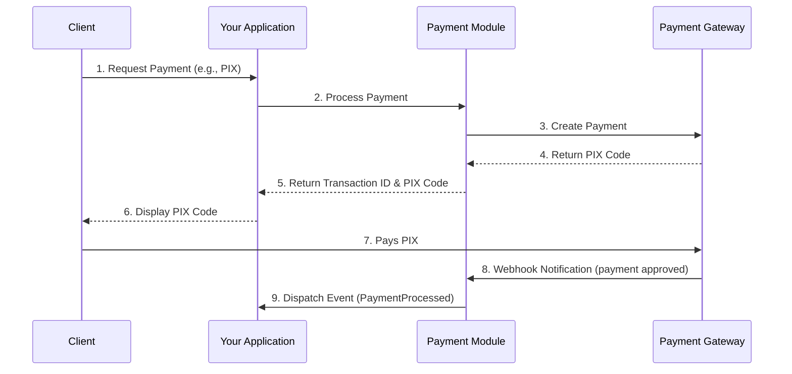

# 💳 Payment Module Manager

[](https://github.com/uendelsilveira/payment-module-manager/actions)
[](https://codecov.io/gh/uendelsilveira/payment-module-manager)
[](https://packagist.org/packages/uendelsilveira/payment-module-manager)


[](https://www.php.net/)
[](https://laravel.com)

**Status:** ✅ **PRODUÇÃO-READY**

---

## ✨ Funcionalidades Principais

O módulo foi reestruturado com foco em segurança, escalabilidade e manutenibilidade, implementando as melhores práticas de desenvolvimento de software.

### Segurança
- **Autenticação e Autorização:** Middlewares configuráveis para proteger rotas com estratégias como `api_token`, `laravel_auth` ou `custom`.
- **Proteção de Credenciais:** As credenciais nunca são expostas via API, sendo sempre mascaradas.
- **Validação de Webhook:** Assinatura de webhooks do gateway de pagamento é validada compulsoriamente em ambiente de produção, incluindo proteção contra *replay attacks*.
- **Rate Limiting:** Proteção contra abuso e ataques de força bruta com limites de requisição configuráveis por tipo de endpoint.
- **Validação de Idempotência:** Previne o processamento duplicado de transações através de uma `Idempotency-Key`.

### Arquitetura e Performance
- **Estrutura Modular:** Separação clara de responsabilidades (Services, Repositories, Gateways).
- **Processamento Assíncrono:** Webhooks são processados em filas para respostas mais rápidas e maior resiliência.
- **Cache de Configurações:** As configurações do gateway são cacheadas para minimizar queries ao banco de dados.
- **Índices Otimizados:** Índices de banco de dados implementados nas colunas mais consultadas para queries de alta performance.
- **Logging Estruturado:** Logs detalhados com `Correlation ID` para rastreabilidade completa de requisições.

### Funcionalidades do Gateway
- **Integração com Múltiplos Gateways:** Processa e consulta pagamentos via PIX, Cartão de Crédito (com parcelamento) e Boleto através de diversos gateways.
- **Estornos e Cancelamentos:** Suporte completo para estornar pagamentos aprovados (total ou parcial) e cancelar pagamentos pendentes.
- **Gerenciamento via API:** Credenciais do gateway podem ser gerenciadas através de endpoints da API.
- **Reprocessamento de Falhas:** Comando Artisan (`payment:reprocess-failed`) para reprocessar transações que falharam, com estratégia de *retry* configurável.
- **Relatórios e Métricas:** Endpoints para sumarizar transações e analisar dados por método de pagamento.
- **Health Check:** Endpoint `GET /api/health` para monitorar a saúde da aplicação e suas dependências (banco de dados, cache, API externa).

---

## 📋 Requisitos

- **PHP:** ^8.2
- **Laravel:** ^11.0

---

## 📦 Instalação

Adicione o pacote ao seu projeto via Composer:

```bash
composer require uendelsilveira/payment-module-manager
```

Se o pacote não estiver no Packagist, adicione o repositório ao seu `composer.json`:

```json
// composer.json
"repositories": [
    {
        "type": "vcs",
        "url": "https://github.com/uendelsilveira/payment-module-manager.git"
    }
]
```

---

## ⚙️ Configuração

1.  **Publique o Arquivo de Configuração:**
    ```bash
    php artisan vendor:publish --provider="UendelSilveira\PaymentModuleManager\Providers\PaymentServiceProvider" --tag="config"
    ```
    Isso criará o arquivo `config/payment.php`.

2.  **Execute as Migrações:**
    ```bash
    php artisan migrate
    ```
    Isso criará as tabelas `transactions` e `payment_settings`, agora com `soft deletes` e índices otimizados.

3.  **Configure as Variáveis de Ambiente (.env):**
    Estas variáveis servem como fallback se nenhuma configuração for encontrada no banco de dados.

    ```dotenv
    # Define o gateway de pagamento padrão.
    PAYMENT_DEFAULT_GATEWAY=""
    ```

---

## 🚀 Quick Start

Para começar a usar o módulo rapidamente, siga estes passos:

1.  **Configure suas credenciais** no arquivo `.env`.
2.  **Execute as migrações:** `php artisan migrate`.
3.  **Processe um pagamento (PIX):**
    ```bash
    curl -X POST "http://localhost/api/payment/process" \
         -H "Content-Type: application/json" \
         -H "Authorization: Bearer SEU_API_TOKEN" \
         -H "Idempotency-Key: unique-request-id-123" \
         -d '{
               "amount": 100.50,
               "description": "Produto Exemplo",
               "payer_email": "comprador@email.com",
               "payment_method_id": "pix"
             }'
    ```
4.  **Consulte o pagamento:** (Substitua `{transaction_id}` pelo ID retornado)
    ```bash
    curl -X GET "http://localhost/api/payments/{transaction_id}" \
         -H "Authorization: Bearer SEU_API_TOKEN"
    ```

---

## 📖 Uso Detalhado

### Gerenciamento de Gateways de Pagamento

O pacote utiliza um `PaymentGatewayManager` para gerenciar diferentes provedores de pagamento. Você pode acessar o gerenciador através do container de serviços do Laravel.

#### Obtendo um Gateway

Você pode obter uma instância do gateway padrão ou de um gateway específico:

```php
use UendelSilveira\PaymentModuleManager\PaymentGatewayManager;
use UendelSilveira\PaymentModuleManager\Contracts\PaymentGatewayInterface;

// Obtém o gateway padrão (definido em config/payment.php ou .env)
$defaultGateway = app(PaymentGatewayManager::class)->gateway();

// Obtém um gateway específico pelo nome
$specificGateway = app(PaymentGatewayManager::class)->gateway('some_gateway_name');

// Exemplo de uso:
$paymentData = [
    'amount' => 100.00,
    'currency' => 'BRL',
    // ... outros dados específicos do gateway
];
$response = $defaultGateway->processPayment($paymentData);
```

#### Adicionando Novos Gateways

Você pode estender o `PaymentGatewayManager` para adicionar suporte a novos gateways de pagamento. Isso é feito no seu `PaymentServiceProvider` (ou em outro Service Provider):

```php
// Em app/Providers/AppServiceProvider.php ou um Service Provider customizado
use UendelSilveira\PaymentModuleManager\PaymentGatewayManager;
use UendelSilveira\PaymentModuleManager\Contracts\PaymentGatewayInterface;
use Illuminate\Support\ServiceProvider;

class AppServiceProvider extends ServiceProvider
{
    public function register(): void
    {
        // ...
    }

    public function boot(): void
    {
        $this->app->make(PaymentGatewayManager::class)->extend('stripe', function ($config) {
            return new class($config) implements PaymentGatewayInterface {
                public function __construct(protected array $config) {}
                public function processPayment(array $data): array {
                    // Lógica de processamento do Stripe
                    return ['transaction_id' => 'stripe_txn_123', 'status' => \UendelSilveira\PaymentModuleManager\Enums\PaymentStatus::APPROVED];
                }
                public function refundPayment(string $paymentId, ?float $amount = null): array { return []; }
                public function getPaymentStatus(string $paymentId): \UendelSilveira\PaymentModuleManager\Enums\PaymentStatus { return \UendelSilveira\PaymentModuleManager\Enums\PaymentStatus::UNKNOWN; }
                public function cancelPayment(string $paymentId): array { return []; }
                public function createWebhook(array $data): array { return []; }
                public function processWebhook(array $data): array { return []; }
                public function getConfig(): array { return $this->config; }
            };
        });
    }
}
```

Certifique-se de que a configuração para o novo gateway (`stripe` neste exemplo) esteja presente em `config/payment.php`:

```php
// config/payment.php
return [
    'default_gateway' => env('PAYMENT_DEFAULT_GATEWAY', 'default_gateway_name'),

    'gateways' => [
        'default_gateway_name' => [
            // ... configurações do gateway padrão
        ],
        'stripe' => [
            'api_key' => env('STRIPE_API_KEY'),
            'secret_key' => env('STRIPE_SECRET_KEY'),
        ],
    ],
    // ...
];
```

### Documentação da API (OpenAPI)

Uma documentação detalhada da API está disponível no formato OpenAPI. Visualize-a com ferramentas como o [Swagger Editor](https://editor.swagger.io/).

[**Ver a Documentação da API (openapi.yaml)**](./docs/openapi.yaml)

### Endpoints e Exemplos

#### `POST /api/payment/process`

Cria e processa um novo pagamento.

**Exemplo de Requisição (Cartão de Crédito):**
```bash
curl -X POST "http://localhost/api/payment/process" \
     -H "Content-Type: application/json" \
     -H "Authorization: Bearer SEU_API_TOKEN" \
     -d '{
           "amount": 199.90,
           "description": "Assinatura Premium",
           "payer_email": "cliente@example.com",
           "payment_method_id": "credit_card",
           "token": "...",
           "installments": 1,
           "issuer_id": "...",
           "payer": { "first_name": "João", "last_name": "Silva", "identification": { "type": "CPF", "number": "..." } }
         }'
```

**Exemplo de Requisição (Boleto):**
```bash
curl -X POST "http://localhost/api/payment/process" \
     -H "Content-Type: application/json" \
     -H "Authorization: Bearer SEU_API_TOKEN" \
     -d '{
           "amount": 100.00,
           "description": "Pagamento de Fatura",
           "payer_email": "cliente@example.com",
           "payment_method_id": "boleto",
           "payer": { "first_name": "Maria", "last_name": "Souza", "identification": { "type": "CPF", "number": "11122233344" }, "address": { "zip_code": "01000000", "street_name": "Rua Exemplo", "street_number": "123", "neighborhood": "Centro", "city": "São Paulo", "federal_unit": "SP" } }
         }'
```

**Exemplo de Resposta (Sucesso - PIX):**
```json
{
    "status": "success",
    "message": "Payment processed successfully.",
    "data": {
        "transaction_id": "d8f2b3a0-6b7a-4b1e-8b0a-1b2c3d4e5f6a",
        "status": "pending",
        "pix_qr_code": "...",
        "pix_qr_code_base64": "..."
    }
}
```

**Exemplo de Resposta (Erro de Validação):**
```json
{
    "message": "The given data was invalid.",
    "errors": {
        "amount": [
            "The amount must be a number."
        ]
    }
}
```

#### `POST /api/payments/{transaction_id}/refund`

Realiza o estorno total ou parcial de um pagamento aprovado.

**Exemplo de Requisição (Estorno Total):**
```bash
curl -X POST "http://localhost/api/payments/d8f2b3a0-6b7a-4b1e-8b0a-1b2c3d4e5f6a/refund" \
     -H "Content-Type: application/json" \
     -H "Authorization: Bearer SEU_API_TOKEN"
```

**Exemplo de Requisição (Estorno Parcial):**
```bash
curl -X POST "http://localhost/api/payments/d8f2b3a0-6b7a-4b1e-8b0a-1b2c3d4e5f6a/refund" \
     -H "Content-Type: application/json" \
     -H "Authorization: Bearer SEU_API_TOKEN" \
     -d '{"amount": 50.00}'
```

**Exemplo de Resposta (Sucesso):**
```json
{
    "status": "success",
    "message": "Estorno processado com sucesso.",
    "data": {
        "id": "123456789",
        "payment_id": "987654321",
        "amount": 50.00,
        "status": "approved",
        "date_created": "2025-11-06T19:30:00.000Z"
    }
}
```

#### `POST /api/payments/{transaction_id}/cancel`

Cancela um pagamento que ainda está pendente ou em processamento.

**Exemplo de Requisição:**
```bash
curl -X POST "http://localhost/api/payments/d8f2b3a0-6b7a-4b1e-8b0a-1b2c3d4e5f6a/cancel" \
     -H "Content-Type: application/json" \
     -H "Authorization: Bearer SEU_API_TOKEN"
```

**Exemplo de Resposta (Sucesso):**
```json
{
    "status": "success",
    "message": "Pagamento cancelado com sucesso.",
    "data": {
        "id": "987654321",
        "status": "cancelled",
        "transaction_amount": 100.00,
        "description": "Pagamento cancelado pelo usuário",
        "payment_method_id": "pix"
    }
}
```

### Comandos Artisan

-   **Reprocessar Pagamentos Falhos:**
    ```bash
    php artisan payment:reprocess-failed --limit=10 --max-retries=3 --dry-run
    ```

---

## 🛡️ Segurança

### Configurando a Autenticação

A autenticação é configurada no arquivo `config/payment.php`. Você pode escolher uma das seguintes estratégias:

-   `none`: Nenhuma autenticação (use apenas em desenvolvimento).
-   `api_token`: Um token de API fixo, definido no arquivo de configuração.
-   `laravel_auth`: Usa o sistema de autenticação padrão do Laravel (ex: Sanctum).
-   `custom`: Permite que você defina um callback customizado para sua própria lógica de autenticação.

---

##  diagrams

### Fluxo de Pagamento



---

## 🤔 Troubleshooting (Problemas Comuns)

-   **Erro `InvalidArgumentException` ao obter gateway:**
    -   **Causa:** O nome do gateway solicitado não está configurado em `config/payment.php` ou não foi estendido.
    -   **Solução:** Verifique se o nome do gateway está correto e se suas configurações estão presentes no array `payment.gateways` ou se você o estendeu corretamente.

-   **Erro `InvalidConfigurationException`:**
    -   **Causa:** As credenciais do gateway de pagamento não foram configuradas corretamente.
    -   **Solução:** Verifique se as variáveis de ambiente do gateway estão definidas no seu arquivo `.env` ou se foram salvas via API.

-   **Pagamentos falham com `401 Unauthorized`:**
    -   **Causa:** O middleware de autenticação está bloqueando a requisição.
    -   **Solução:** Certifique-se de que a estratégia de autenticação em `config/payment.php` está correta e que você está enviando o token de autorização no cabeçalho da requisição (`Authorization: Bearer SEU_TOKEN`).

---

## 🗺️ Roadmap e Contribuições

Este projeto é mantido ativamente. Contribuições são bem-vindas! Antes de contribuir, por favor, leia o arquivo `CONTRIBUTING.md` (a ser criado).

### 🔄 Versionamento Automático

Este projeto utiliza **versionamento semântico automático** baseado em [Conventional Commits](https://www.conventionalcommits.org/).

#### Como funciona:

1. **Commits seguem o padrão convencional:**
   - `feat:` - Nova funcionalidade (incrementa MINOR: 1.0.0 → 1.1.0)
   - `fix:` - Correção de bug (incrementa PATCH: 1.0.0 → 1.0.1)
   - `feat!:` ou `BREAKING CHANGE:` - Mudança que quebra compatibilidade (incrementa MAJOR: 1.0.0 → 2.0.0)

2. **Ao fazer push para `main`:**
   - Testes são executados automaticamente
   - Versão é calculada baseada nos commits
   - `README.md` e `composer.json` são atualizados
   - Changelog é gerado automaticamente
   - Tag Git e GitHub Release são criados

3. **Exemplo de uso:**
   ```bash
   # Feature nova (minor bump)
   git commit -m "feat(pix): adicionar suporte a QR code dinâmico"
   
   # Bug fix (patch bump)
   git commit -m "fix(webhook): corrigir validação de assinatura"
   
   # Breaking change (major bump)
   git commit -m "feat!: migrar para nova API do Gateway"
   ```

📖 **[Ver guia completo de commits convencionais](.github/COMMIT_CONVENTION.md)**

#### Versionamento Semântico

Este projeto segue o [Versionamento Semântico 2.0.0](https://semver.org/spec/v2.0.0.html). 

- **MAJOR** (X.0.0): Mudanças incompatíveis com versões anteriores
- **MINOR** (0.X.0): Novas funcionalidades mantendo compatibilidade
- **PATCH** (0.0.X): Correções de bugs mantendo compatibilidade

Para ver as mudanças detalhadas de cada versão, consulte as [GitHub Releases](https://github.com/uendelsilveira/payment-module-manager/releases).

### Próximos Passos
- Criação de `CONTRIBUTING.md`.
- Integração com Codecov e GitHub Actions para relatórios de cobertura e build status.
- Configuração de análise estática com PHPStan/Psalm.
- Suporte a Docker para um ambiente de desenvolvimento padronizado.

---

## 📄 Licença

Este projeto está licenciado sob a Licença MIT.

© 2025 Uendel Silveira - Full Stack Developer
